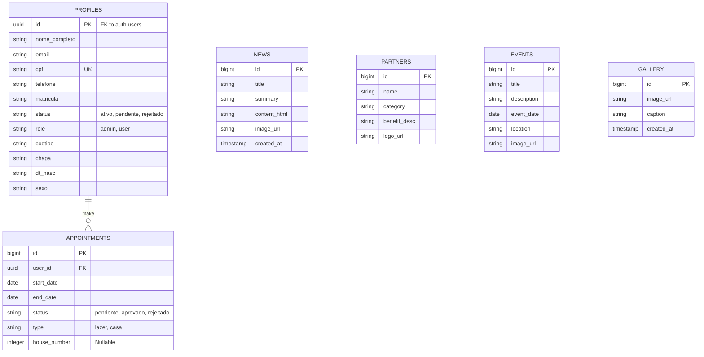

# System Diagram

This document contains the Entity Relationship Diagram (ERD) for the Asfus-Mobile application database.

```mermaid
erDiagram
    PROFILES ||--o{ APPOINTMENTS : make
    PROFILES {
        uuid id PK "FK to auth.users"
        string nome_completo
        string email
        string cpf UK
        string telefone
        string matricula
        string status "ativo, pendente, rejeitado"
        string role "admin, user"
        string codtipo
        string chapa
        string dt_nasc
        string sexo
    }

    APPOINTMENTS {
        bigint id PK
        uuid user_id FK
        date start_date
        date end_date
        string status "pendente, aprovado, rejeitado"
        string type "lazer, casa"
        integer house_number "Nullable"
    }

    NEWS {
        bigint id PK
        string title
        string summary
        string content_html
        string image_url
        timestamp created_at
    }

    PARTNERS {
        bigint id PK
        string name
        string category
        string benefit_desc
        string logo_url
    }

    EVENTS {
        bigint id PK
        string title
        string description
        date event_date
        string location
        string image_url
    }

    GALLERY {
        bigint id PK
        string image_url
        string caption
        timestamp created_at
    }
```
